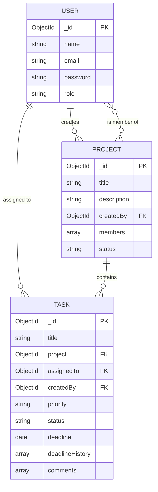

# Teamly — Team Project & Task Management App

A full-stack MERN application for teams to manage projects and tasks, with role-based access for Admins and Team Members.

## Live Links
- Frontend: [Link](https://teamly-fe.vercel.app/login)
- Backend API: [Link](https://teamly-be.vercel.app/)
- GitHub Repo: https://github.com/Shikha246/team-task-manager

## Features

### Admin
- Create and manage projects
- Add team members (creates their login credentials directly)
- Create tasks, assign them to team members
- Set task priority and deadlines
- View project progress (completion %, overdue tasks)

### Team Member
- View tasks assigned to them
- Update task status (To Do / In Progress / Completed)
- Add comments / progress updates on tasks
- View task deadlines and priorities
- View deadline change history for any task

## Tech Stack
- **Frontend:** React (Vite), React Router, Axios, Bootstrap, React Toastify
- **Backend:** Node.js, Express.js
- **Database:** MongoDB (Atlas) with Mongoose
- **Auth:** JWT (JSON Web Tokens), bcryptjs for password hashing
- **Validation:** express-validator (backend), custom validation (frontend)
- **Deployment:** Vercel (frontend + backend as separate projects)

## Project Structure
\`\`\`
team-task-manager/
├── server/          # Express + MongoDB backend
│   ├── config/      # DB connection
│   ├── controllers/ # Route logic
│   ├── middleware/  # Auth, validation, error handling
│   ├── models/      # Mongoose schemas
│   ├── routes/      # API routes
│   ├── utils/       # Helper functions
│   └── index.js     # App entry point
└── client/          # React + Vite frontend
    ├── src/
    │   ├── api/         # Axios instance + API service calls
    │   ├── components/  # Reusable components (Navbar, PrivateRoute)
    │   ├── context/     # Auth context
    │   └── pages/       # Route-level pages
    └── vite.config.js
\`\`\`

## Local Installation

### Prerequisites
- Node.js (v18+)
- A MongoDB Atlas account (or local MongoDB)

### 1. Clone the repo
\`\`\`bash
git clone https://github.com/Shikha246/team-task-manager.git
cd team-task-manager
\`\`\`

### 2. Backend setup
\`\`\`bash
cd server
npm install
\`\`\`

Create a \`.env\` file in \`server/\`:
\`\`\`
PORT=5000
MONGO_URI=your_mongodb_atlas_connection_string
JWT_SECRET=your_long_random_secret
JWT_EXPIRES_IN=7d
CLIENT_URL=http://localhost:5173
NODE_ENV=development
\`\`\`

Run the server:
\`\`\`bash
npm run dev
\`\`\`

### 3. Frontend setup
\`\`\`bash
cd ../client
npm install
\`\`\`

Create a \`.env\` file in \`client/\`:
\`\`\`
VITE_API_URL=http://localhost:5000/api
\`\`\`

Run the frontend:
\`\`\`bash
npm run dev
\`\`\`

Visit \`http://localhost:5173\`.

### 4. First-time setup
- Go to \`/setup-admin\` to create the first Admin account (this route only works when no users exist yet).
- Log in as Admin, go to "Manage Team Members" to create Team Member accounts.
- Create projects, add members, create and assign tasks.


## Deadline History Feature
Whenever an Admin changes a task's deadline, the system logs the previous deadline, the new deadline, who changed it, and when — visible on the Task Detail page under "Deadline History." This is powered by an embedded `deadlineHistory` array on each Task document.
\`\`\`

Fill in your actual live URLs at the top before submitting.

### 12.2 — `docs/API.md`

```markdown
# API Documentation

Base URL (local): `http://localhost:5000/api`
Base URL (production): `https://your-backend-url.vercel.app/api`

All protected routes require a header:
`Authorization: Bearer <token>`

## Auth

| Method | Endpoint | Access | Description |
|---|---|---|---|
| POST | /auth/register | Public (first user) / Admin only (after) | Register a user. First user becomes Admin automatically. |
| POST | /auth/login | Public | Login, returns JWT + user info |
| GET | /auth/me | Private | Get logged-in user's profile |
| GET | /auth/users | Admin | List all users |

## Projects

| Method | Endpoint | Access | Description |
|---|---|---|---|
| POST | /projects | Admin | Create a project |
| GET | /projects | Private | List projects (Admin: all; Member: only their own) |
| GET | /projects/:id | Private | Get a single project |
| PUT | /projects/:id | Admin | Update project details |
| PUT | /projects/:id/members | Admin | Add members to a project |
| GET | /projects/:id/progress | Private | Get task-completion progress for a project |
| DELETE | /projects/:id | Admin | Delete a project (and its tasks) |

## Tasks

| Method | Endpoint | Access | Description |
|---|---|---|---|
| POST | /tasks | Admin | Create a task and assign it to a project member |
| GET | /tasks | Private | List tasks (Admin: all/by project; Member: only assigned to them). Supports `?status=` and `?priority=` filters |
| GET | /tasks/:id | Private | Get a single task (with deadline history & comments) |
| PUT | /tasks/:id | Admin | Update task (title, description, priority, assignee, deadline). Deadline changes are logged automatically. |
| PATCH | /tasks/:id/status | Private (assignee/admin) | Update task status |
| POST | /tasks/:id/comments | Private (assignee/admin) | Add a comment/progress update |
| GET | /tasks/:id/deadline-history | Private | Get the full deadline change history for a task |
| DELETE | /tasks/:id | Admin | Delete a task |

## Error Response Format
\`\`\`json
{
  "message": "Description of the error",
  "errors": [ { "field": "email", "message": "Valid email is required" } ]
}
\`\`\`

## Sample Request/Response

**POST /tasks**
\`\`\`json
// Request
{
  "title": "Design homepage mockup",
  "description": "Create wireframes in Figma",
  "project": "64f...",
  "assignedTo": "64f...",
  "priority": "high",
  "deadline": "2026-09-15"
}

// Response (201)
{
  "_id": "64f...",
  "title": "Design homepage mockup",
  "status": "todo",
  "priority": "high",
  "deadline": "2026-09-15T00:00:00.000Z",
  "assignedTo": { "_id": "64f...", "name": "John", "email": "john@test.com" },
  "project": { "_id": "64f...", "title": "Website Revamp" },
  "deadlineHistory": [],
  "comments": []
}
\`\`\`
```

### 12.3 — ER Diagram


